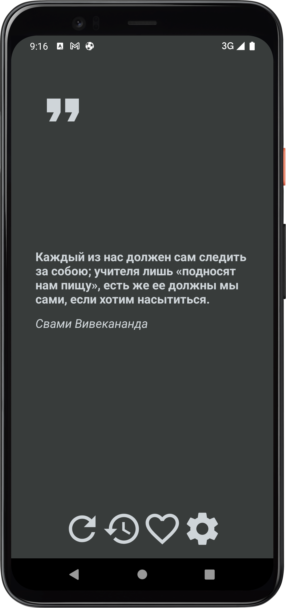
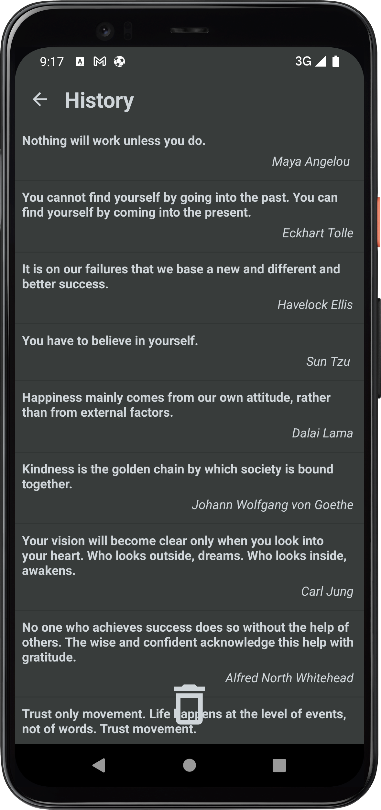
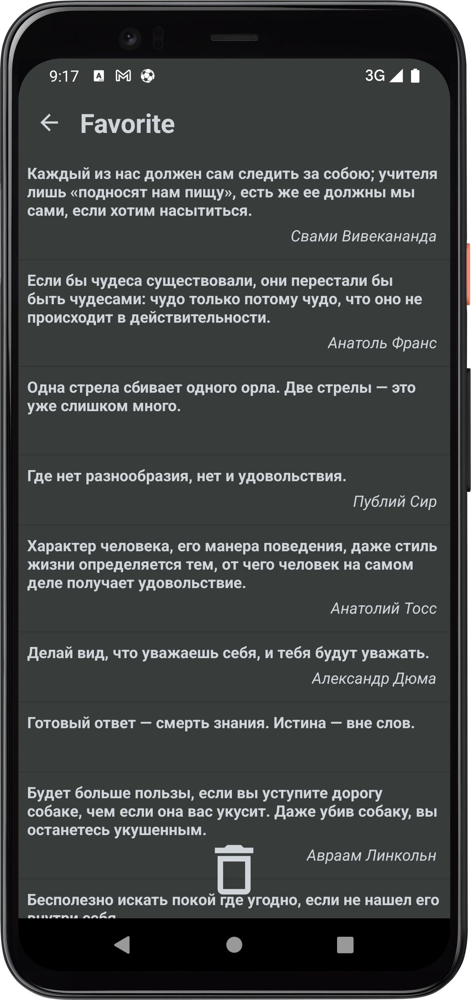
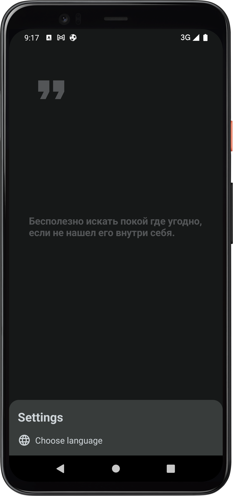

____

# Quote of the day

> Этот проект является частью моего обучения на Kotlin для разработки приложений для Android.

____

## Скриншоты:

|  |  |  |  |
| ---------------------------------------------- | -------------------------------------------- | -------------------------------------------- | -------------------------------------------- |

____

### Техническое составляющее проекта:

- Navigation Component
- Retrofit
- Coroutines
- Flow
- Room
- DataStore
- Hilt

____
